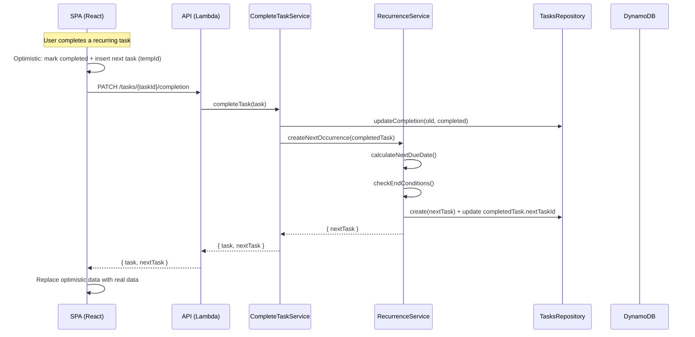

# Recurring Tasks — Design

**Spec:** `.specs/features/recurring-tasks/spec.md`
**Context:** `.specs/features/recurring-tasks/context.md`
**Status:** Draft

---

## Architecture Overview



---

## Code Reuse Analysis

### Existing Components to Leverage

| Component | Location | How to Use |
|-----------|----------|------------|
| `CompleteTaskService` | `services/complete-task/service.ts` | Extend to call `RecurrenceService` after completing |
| `CreateTasksService` | `services/create/service.ts` | Reuse `repository.create()` pattern for spawning next task |
| `TasksDynamoMapper` | `mappers/tasks/task-mapper.ts` | Extend `toDomain`/`toDatabase` to handle `recurrence` + `nextTaskId` fields |
| `TasksDynamoRepository` | `repositories/tasks/tasks-dynamo-repository.ts` | Add `update()` method; reuse `create()` for next occurrence |
| `RecurrencePanel` (SPA) | `view/forms/task/recurrence-panel.tsx` | Already complete — no changes needed |
| `formatRecurrencePreview` (SPA) | `view/forms/task/format-recurrence-preview.ts` | Reuse for tooltip text in task cards |
| `tasksInboxCache` | `app/cache/tasks-inbox.cache.ts` | Extend with method for adding next occurrence optimistically |
| `projectDetailCache` | `projects/app/cache/project-detail.cache.ts` | Same — extend for next occurrence |
| Optimistic update pattern | `hooks/use-create-tasks.ts` | Follow same tempId + OptimisticState flow |
| Factory pattern | `factories/services/tasks/` | Follow for new services |
| Controller pattern | `controllers/create/controller.ts` | Follow for update controller |

### Integration Points

| System | Integration Method |
|--------|-------------------|
| DynamoDB | `recurrence` stored as nested map attribute; `nextTaskId` as string attribute — no new GSI needed |
| Contracts | New `Recurrence` interface + fields on `Task`; new `update` schema |
| Serverless | New function entry in `serverless.yml` for `PUT /tasks/{taskId}` |

---

## Data Models

### Recurrence (new type in contracts)

```typescript
// packages/contracts/src/tasks/entities/index.ts

interface Recurrence {
  enabled: boolean;
  frequency: "daily" | "weekly" | "monthly" | "yearly";
  weeklyDays?: number[];        // 0=Sun..6=Sat
  endType: "never" | "on_date" | "after_count";
  endDate?: string;             // ISO date string
  endCount?: number;            // remaining occurrences
}
```

### Task Entity (modified)

```typescript
// Two new fields added to Task
interface Task {
  // ... existing fields ...
  recurrence: Recurrence | null;  // NEW
  nextTaskId: string | null;      // NEW — ID of next occurrence (set on completion)
}
```

### DynamoDB Storage

`recurrence` is stored as a **nested map** on the task item — no separate table or index:

```json
{
  "PK": "USER#abc",
  "SK": "TASK#INBOX#PENDING#0#task123",
  "recurrence": {
    "enabled": true,
    "frequency": "weekly",
    "weekly_days": [1, 3, 5],
    "end_type": "never"
  },
  "next_task_id": null
}
```

The mapper converts `camelCase ↔ snake_case` as it already does for other fields.

---

## Components

### 1. RecurrenceService (NEW)

- **Purpose:** Calculate next occurrence date and create the next task when a recurring task is completed
- **Location:** `apps/api/src/app/modules/tasks/services/recurrence/service.ts`
- **Interfaces:**
  - `createNextOccurrence(task: Task): Promise<{ nextTask: Task } | null>` — returns null if end condition reached or nextTask already exists
- **Dependencies:** `ITasksRepository`
- **Reuses:** `repository.create()` pattern, `repository.getByUserId()` for duplicate check

**Internal logic:**

```typescript
async createNextOccurrence(completedTask: Task): Promise<{ nextTask: Task } | null> {
  // 1. Guard: recurrence must be enabled
  if (!completedTask.recurrence?.enabled) return null;

  // 2. Guard: check if next occurrence already exists (uncomplete → re-complete scenario)
  if (completedTask.nextTaskId) {
    const existing = await this.taskRepository.getByUserId(
      completedTask.nextTaskId,
      completedTask.userId,
      completedTask.projectId,
    );
    if (existing && !existing.completed) return null; // already exists and pending
  }

  // 3. Calculate next due date
  const nextDueDate = this.calculateNextDueDate(completedTask);

  // 4. Check end conditions
  if (!this.shouldCreateNext(completedTask.recurrence, nextDueDate)) return null;

  // 5. Build next recurrence (decrement count if after_count)
  const nextRecurrence = this.buildNextRecurrence(completedTask.recurrence);

  // 6. Create next task
  const nextTask = await this.taskRepository.create({
    userId: completedTask.userId,
    title: completedTask.title,
    description: completedTask.description,
    priority: completedTask.priority,
    projectId: completedTask.projectId,
    sectionId: completedTask.sectionId,
    dueDate: nextDueDate,
    recurrence: nextRecurrence,
  });

  // 7. Update completed task with nextTaskId
  await this.taskRepository.updateField(
    completedTask.id,
    completedTask.userId,
    completedTask.projectId,
    { nextTaskId: nextTask.id },
  );

  return { nextTask };
}
```

### 2. RecurrenceDateCalculator (NEW — pure utility)

- **Purpose:** Pure functions for calculating next due dates based on frequency
- **Location:** `apps/api/src/app/modules/tasks/services/recurrence/date-calculator.ts`
- **Interfaces:**
  - `calculateNextDueDate(task: Task): string | null` — returns ISO date string
- **Dependencies:** None (pure functions)

**Rules (from context.md):**

| Frequency | Logic |
|-----------|-------|
| `daily` | baseDate + 1 day |
| `weekly` | Find next day in `weeklyDays` from today; wrap around if needed |
| `monthly` | Same day-of-month next month; clamp to month-end (31→28/30) |
| `yearly` | Same day next year; handle Feb 29→28 on non-leap |

**Base date selection:**
- Task has `dueDate` → use `dueDate` as base (even if completed later)
- Task has no `dueDate` → use `completedAt` as base
- For `weekly`: always find next valid day **from today**, regardless of base date

### 3. CompleteTaskService (MODIFIED)

- **Purpose:** Complete a task and trigger next occurrence creation
- **Location:** `apps/api/src/app/modules/tasks/services/complete-task/service.ts`
- **Change:** After completing task, call `RecurrenceService.createNextOccurrence()`
- **Return type change:** `{ task: Task }` → `{ task: Task, nextTask?: Task }`

```typescript
// Modified execute method
async execute(input: CompleteTaskInput): Promise<CompleteTaskOutput> {
  const updatedTask = { ...input.task, completed: true, completedAt: now, updatedAt: now };
  await this.taskRepository.updateCompletion(input.task, updatedTask);

  // NEW: handle recurrence
  const recurrenceResult = await this.recurrenceService.createNextOccurrence(updatedTask);

  return {
    task: updatedTask,
    nextTask: recurrenceResult?.nextTask,  // NEW
  };
}
```

### 4. UpdateTaskService (NEW)

- **Purpose:** General task field update (title, description, priority, dueDate, recurrence, project, section)
- **Location:** `apps/api/src/app/modules/tasks/services/update-task/service.ts`
- **Interfaces:**
  - `execute(input: UpdateTaskInputService): Promise<{ task: Task }>`
- **Dependencies:** `ITasksRepository`

```typescript
interface UpdateTaskInputService {
  userId: string;
  taskId: string;
  title?: string;
  description?: string | null;
  priority?: "low" | "medium" | "high" | null;
  dueDate?: string | null;
  projectId?: string | null;
  sectionId?: string | null;
  recurrence?: Recurrence | null;
}
```

### 5. UpdateTaskController (NEW)

- **Purpose:** HTTP controller for `PUT /tasks/{taskId}`
- **Location:** `apps/api/src/app/modules/tasks/controllers/update-task/controller.ts`
- **Reuses:** Same `Controller<"private", ...>` pattern as create/completion

### 6. UpdateTask Lambda Handler (NEW)

- **Purpose:** Serverless function entry point
- **Location:** `apps/api/src/server/functions/tasks/update-task/handler.ts`
- **Config:** `apps/api/src/server/functions/tasks/update-task/index.ts`

### 7. ITasksRepository (MODIFIED)

- **Purpose:** Add `update()` and `updateField()` methods
- **Location:** `apps/api/src/data/protocols/tasks/tasks-repository.ts`

```typescript
// New methods on ITasksRepository
update(taskId: string, userId: string, projectId: string | null, data: Partial<Task>): Promise<Task>;
updateField(taskId: string, userId: string, projectId: string | null, fields: Record<string, unknown>): Promise<void>;
```

**Note on `update()`:** Unlike `updateCompletion` (which changes SK and requires transact delete+put), a general update of fields like title/description/recurrence does NOT change PK/SK. This means we can use a simple `UpdateItem` expression — much simpler.

**Exception:** If `projectId` changes (task moves between project/inbox), the PK changes → requires transact delete+put (same pattern as `updateCompletion`). This edge case must be handled.

### 8. TasksDynamoMapper (MODIFIED)

- **Purpose:** Add `recurrence` and `nextTaskId` to `toDomain()` / `toDatabase()`
- **Location:** `apps/api/src/infra/db/dynamodb/mappers/tasks/task-mapper.ts`

```typescript
// toDatabase — add to existing mapping
recurrence: task.recurrence ? {
  enabled: task.recurrence.enabled,
  frequency: task.recurrence.frequency,
  weekly_days: task.recurrence.weeklyDays,
  end_type: task.recurrence.endType,
  end_date: task.recurrence.endDate,
  end_count: task.recurrence.endCount,
} : null,
next_task_id: task.nextTaskId ?? null,

// toDomain — add to existing mapping
recurrence: dbEntity.recurrence ? {
  enabled: dbEntity.recurrence.enabled,
  frequency: dbEntity.recurrence.frequency,
  weeklyDays: dbEntity.recurrence.weekly_days,
  endType: dbEntity.recurrence.end_type,
  endDate: dbEntity.recurrence.end_date,
  endCount: dbEntity.recurrence.end_count,
} : null,
nextTaskId: dbEntity.next_task_id ?? null,
```

---

## SPA Components

### 9. Contracts — Update Task (NEW)

- **Location:** `packages/contracts/src/tasks/update/`
- **Files:** `schema.ts`, `input.ts`, `output.ts`, `index.ts`
- **Schema:** Same fields as create but all optional (partial update)
- **Adds `recurrence` to `createTaskSchema`** as well

### 10. Completion Output (MODIFIED)

```typescript
// packages/contracts/src/tasks/completion/output.ts
interface UpdateTaskCompletionOutput {
  task: Task;
  nextTask?: Task;  // NEW — present when recurrence spawned a new task
}
```

### 11. SPA Mapper — Create (MODIFIED)

- **Location:** `apps/spa/src/modules/tasks/app/mappers/create-tasks.ts`
- **Change:** Include `recurrence` field in output (currently omitted)

```typescript
// Add to mapTaskFormToCreateInput
recurrence: formData.recurrence?.enabled
  ? {
      enabled: true,
      frequency: formData.recurrence.frequency!,
      weeklyDays: formData.recurrence.weeklyDays,
      endType: formData.recurrence.endType!,
      endDate: formData.recurrence.endDate?.toISOString(),
      endCount: formData.recurrence.endCount,
    }
  : null,
```

### 12. SPA Mapper — Update (NEW)

- **Location:** `apps/spa/src/modules/tasks/app/mappers/update-task.ts`
- **Purpose:** Map form data to UpdateTaskInput (partial update)

### 13. SPA Service — Update Task (NEW)

- **Location:** `apps/spa/src/modules/tasks/app/services/update-task.ts`
- **Purpose:** `PUT /tasks/{taskId}` HTTP call

### 14. SPA Hook — useUpdateTask (NEW)

- **Location:** `apps/spa/src/modules/tasks/app/hooks/use-update-task.ts`
- **Purpose:** TanStack mutation for updating task, with optimistic updates

### 15. SPA Hook — useUpdateTaskCompletion (MODIFIED)

- **Location:** `apps/spa/src/modules/tasks/app/hooks/use-update-task-completion.ts`
- **Change:** `onMutate` adds next task optimistically; `onSuccess` replaces with `data.nextTask`

**Optimistic flow for completion of recurring task:**
1. `onMutate`: mark task as completed (existing) + generate tempId + insert next task in cache with `OptimisticState.PENDING`
2. `onSuccess`: replace completed task with `data.task`, replace tempId with `data.nextTask`
3. `onError`: restore both snapshots

### 16. SPA — Task Card Recurrence Indicator (NEW)

- **Purpose:** Show repeat icon + tooltip on task cards
- **Location:** Inline in existing task card components (small addition, not a separate component)
- **Reuses:** `formatRecurrencePreview()` for tooltip text, `Repeat` icon from lucide-react

---

## Error Handling Strategy

| Error Scenario | Handling | User Impact |
|----------------|----------|-------------|
| Complete recurring task but `create` next fails | Complete succeeds (already committed); log error; `nextTask` absent from response | Task completes normally; next occurrence missing — user can re-trigger by uncompleting and completing again |
| Update task with invalid recurrence | Schema validation rejects at controller | 400 error with validation message |
| `nextTaskId` points to deleted task | `getByUserId` returns null → creates new occurrence normally | Transparent to user |
| End condition reached | `createNextOccurrence` returns null | Task completes with no next occurrence — expected behavior |

---

## Tech Decisions

| Decision | Choice | Rationale |
|----------|--------|-----------|
| Recurrence storage | Nested map on task item | No new table/index; natural co-location; read in same query |
| `nextTaskId` vs `originTaskId` | `nextTaskId` on completed task | Enables direct lookup via existing `getByUserId()`; no new GSI |
| RecurrenceService vs inline logic | Separate service | Date calculation is complex enough to warrant isolation + testability |
| `updateField` vs full `update` | Both methods on repository | `updateField` for lightweight patches (nextTaskId); `update` for full edits |
| Completion atomicity | Non-transactional (complete first, then create next) | If next-task creation fails, the completion still succeeded — no data loss, just missing next occurrence that can be re-triggered |
| Weekly "next day" from today | From today, not from dueDate | Context decision — prevents creating tasks in the past when completing late |
