# Shared Board Design

**Spec**: `.specs/features/shared-board/spec.md`
**Context**: `.specs/features/shared-board/context.md`
**Status**: Draft

---

## Architecture Overview

The sharing feature introduces a cross-cutting **permission layer** between controllers and services, a **unified `ISharingRepository`** for all sharing-related persistence, and new services/controllers. Existing repository interfaces are **never modified** — all cross-entity atomic writes are encapsulated inside `SharingDynamoRepository`, which receives existing mappers to resolve PK/SK of other entities.

```mermaid
graph TD
    subgraph "New: Sharing Module"
        PS[PermissionService]
        IS[InviteToProjectService]
        AIS[AcceptInvitationService]
        DIS[DeclineInvitationService]
        GMI[GetMyInvitationsService]
        GPM[GetProjectMembersService]
        GPI[GetProjectInvitationsService]
        CI[CancelInvitationService]
        UMR[UpdateMemberRoleService]
        RM[RemoveMemberService]
        US[UserSearchService]
    end

    subgraph "New: Repository"
        SR[ISharingRepository]
    end

    subgraph "Existing (modified services, unchanged interfaces)"
        GPD[GetProjectDetailService]
        CT[CreateTaskService]
        UT[UpdateTaskService]
        GAP[GetAllProjectsService]
    end

    subgraph "Existing (unchanged)"
        PR[IProjectRepository]
        UR[IUserRepository]
    end

    PS --> SR
    PS --> PR
    IS --> PS
    IS --> SR
    IS --> UR
    AIS --> SR
    AIS --> UR
    AIS --> PR
    GPD --> PS
    CT --> PS
    GAP --> SR
    GAP --> PR
```



---

## Code Reuse Analysis

### Existing Components to Leverage

| Component | Location | How to Use |
|-----------|----------|------------|
| `Controller<TType, TBody>` | `src/app/interfaces/controller.ts` | Base class for all new controllers |
| `AppError` | `src/app/errors/app-error.ts` | Error class for 403, 409, 410 errors |
| `IDatabaseClient` | `src/infra/db/dynamodb/contracts/client.ts` | DynamoDB access, including `transactWrite` |
| `BaseDynamoDBEntity` | `src/infra/db/dynamodb/contracts/entity.ts` | Base for new DynamoDB entity types |
| `IProjectRepository` | `src/data/protocols/projects/project-repository.ts` | Used by PermissionService to check ownership (interface unchanged) |
| `IUserRepository` | `src/data/protocols/auth/user-repository.ts` | Used by services to get user data (interface unchanged) |
| `ProjectMapper` | `src/infra/db/dynamodb/mappers/projects/project-mapper.ts` | Injected into `SharingDynamoRepository` for PK/SK resolution |
| `lambdaHttpAdapter` | `src/server/adapters/lambda-http-adapter.ts` | Handler wrapper for all new Lambda functions |
| Factory pattern | `src/factories/` | DI wiring for new services/controllers |

### Integration Points

| System | Integration Method |
|--------|-------------------|
| Existing project services | Inject `IPermissionService`; call `requireRole()` before business logic |
| `GET /projects` | Extend to query `BoardAccess` items via `ISharingRepository` + merge shared projects |
| `@repo/contracts` | New `sharing/` module for all shared DTOs |
| `serverless.yml` | New function entries for 10 endpoints |

---

## Components

### Layer 1: Contracts (`packages/contracts/src/sharing/`)

New shared types between API and SPA.

#### `types.ts` — Base types

```typescript
export const SharingRole = {
  OWNER: "owner",
  EDITOR: "editor",
  VIEWER: "viewer",
} as const;
export type SharingRole = (typeof SharingRole)[keyof typeof SharingRole];

export const InvitationStatus = {
  PENDING: "pending",
  ACCEPTED: "accepted",
  DECLINED: "declined",
  EXPIRED: "expired",
} as const;
export type InvitationStatus = (typeof InvitationStatus)[keyof typeof InvitationStatus];

export const ResourceType = {
  PROJECT: "project",
  // BUDGET: "budget",  ← future: finance module
} as const;
export type ResourceType = (typeof ResourceType)[keyof typeof ResourceType];

export const SHARING_ROLE_HIERARCHY: Record<SharingRole, number> = {
  viewer: 0,
  editor: 1,
  owner: 2,
};
```

#### Entity DTOs

```typescript
// entities/board-access.ts
export interface BoardAccessDto {
  id: string;
  resourceType: ResourceType;
  resourceId: string;
  ownerUserId: string;
  guestUserId: string;
  role: Exclude<SharingRole, "owner">;
  acceptedAt: string;
  createdAt: string;
}

// entities/invitation.ts
export interface InvitationDto {
  id: string;
  resourceType: ResourceType;
  resourceId: string;
  projectName: string;
  ownerName: string;
  invitedEmail: string;
  invitedUserId: string | null;
  role: Exclude<SharingRole, "owner">;
  status: InvitationStatus;
  expiresAt: string;
  createdAt: string;
}

// entities/member.ts
export interface MemberDto {
  userId: string;
  name: string;
  email: string;
  role: SharingRole;
  joinedAt: string | null;
}
```

#### Route contracts (per endpoint)

| Folder | Exports |
|--------|---------|
| `invite-to-project/` | `schema.ts` (Zod: email + role), `input.ts`, `output.ts` → `InviteToProjectResponse` |
| `get-my-invitations/` | `output.ts` → `GetMyInvitationsResponse` |
| `accept-invitation/` | `output.ts` → `AcceptInvitationResponse` |
| `get-project-members/` | `output.ts` → `GetProjectMembersResponse` |
| `get-project-invitations/` | `output.ts` → `GetProjectInvitationsResponse` |
| `update-member-role/` | `schema.ts` (Zod: role), `input.ts`, `output.ts` → `UpdateMemberRoleResponse` |
| `user-search/` | `output.ts` → `UserSearchResponse` |

**Modification to existing contracts:**

`packages/contracts/src/projects/entities/index.ts` — Add optional sharing fields:

```typescript
export interface Project {
  // ... existing fields
  role?: SharingRole;        // "owner" for own, "editor"/"viewer" for shared
  isShared?: boolean;        // true when project belongs to another user
  memberCount?: number;      // total members (owner + guests)
}
```

These fields are optional to avoid breaking existing code. The `GET /projects` and `GET /projects/:id/detail` responses populate them.

---

### Layer 2: Data Protocols (`src/data/protocols/sharing/`)

#### `permission-service.ts`

Functions with more than 2 parameters use a typed object.

```typescript
export interface RequireRoleParams {
  requesterId: string;
  resourceType: ResourceType;
  resourceId: string;
  requiredRole: SharingRole;
}

export interface PermissionResult {
  ownerUserId: string;
  effectiveRole: SharingRole;
}

export interface IPermissionService {
  requireRole(params: RequireRoleParams): Promise<PermissionResult>;
}
```

#### `sharing-repository.ts` — Unified Repository

Single interface for ALL sharing-related persistence. Existing repositories (`IProjectRepository`, `IUserRepository`) are **never modified**.

```typescript
export interface ISharingRepository {
  // ── BoardAccess ──────────────────────────────────────────────
  getBoardAccess(params: {
    guestUserId: string;
    resourceType: ResourceType;
    resourceId: string;
  }): Promise<BoardAccess | null>;

  getAllBoardAccessByGuest(guestUserId: string): Promise<BoardAccess[]>;

  // ── Invitations ──────────────────────────────────────────────
  createInvitation(invitation: Invitation): Promise<void>;
  // Triple-write: guest view + owner view + project view

  getInvitationByIdAndEmail(params: {
    invitationId: string;
    guestEmail: string;
  }): Promise<Invitation | null>;

  getAllInvitationsByEmail(email: string): Promise<Invitation[]>;

  getAllInvitationsByProject(projectId: string): Promise<Invitation[]>;

  getPendingInvitation(params: {
    email: string;
    resourceType: ResourceType;
    resourceId: string;
  }): Promise<Invitation | null>;

  // ── Atomic cross-entity operations ───────────────────────────
  acceptInvitation(params: {
    invitation: Invitation;
    boardAccess: BoardAccess;
    newMember: Member;
    project: Project;            // ← service passes the fetched project
    currentMembers: Member[];    //    repo uses projectMapper to get PK/SK
  }): Promise<void>;
  // transactWrite: update 3 invitation views + create BoardAccess + update Project.members[]

  declineInvitation(invitation: Invitation): Promise<void>;
  // Update status across all 3 views

  cancelInvitation(invitation: Invitation): Promise<void>;
  // Soft-delete across all 3 views

  updateMemberRole(params: {
    boardAccess: BoardAccess;
    newRole: SharingRole;
    project: Project;
    updatedMembers: Member[];
  }): Promise<void>;
  // transactWrite: update BoardAccess + update Project.members[]

  removeMember(params: {
    boardAccess: BoardAccess;
    project: Project;
    updatedMembers: Member[];
  }): Promise<void>;
  // transactWrite: soft-delete BoardAccess + update Project.members[]

  // ── Email lookup ─────────────────────────────────────────────
  getUserIdByEmail(email: string): Promise<string | null>;
  // GetItem(PK=USER_EMAIL#<email>, SK=METADATA) → userId
}
```

**Key design principle: services pass domain objects, the repo extracts PK/SK via mappers.**

For `acceptInvitation`, the service already reads the project (for member count validation). It passes the `Project` object to the repo. The `SharingDynamoRepository` calls `projectMapper.toDatabase(project)` to extract `.PK` and `.SK`, then uses them in the `UpdateItem` within `transactWrite`. No need to modify the project repo or mapper.

---

### Layer 3: Domain Entities

New domain types used internally (not exported to contracts, only within API):

```typescript
// src/core/domain/sharing/board-access.ts
export interface BoardAccess {
  id: string;
  resourceType: ResourceType;
  resourceId: string;
  ownerUserId: string;
  guestUserId: string;
  role: SharingRole;
  invitedAt: string;
  acceptedAt: string;
  createdAt: string;
  updatedAt: string;
  deletedAt?: string | null;
}

// src/core/domain/sharing/invitation.ts
export interface Invitation {
  id: string;
  resourceType: ResourceType;
  resourceId: string;
  ownerUserId: string;
  invitedEmail: string;
  invitedUserId: string | null;
  role: SharingRole;
  status: InvitationStatus;
  expiresAt: string;
  createdAt: string;
  updatedAt: string;
}

// src/core/domain/sharing/member.ts
export interface Member {
  userId: string;
  name: string;
  email: string;
  role: SharingRole;
  joinedAt: string | null;
}
```

---

### Layer 4: DynamoDB Infrastructure

#### Mapper Injection Pattern

The `SharingDynamoRepository` needs to write/update items that belong to other entities (Project, User). Instead of duplicating PK/SK logic, it **receives existing mappers** via constructor and uses `toDatabase()` to resolve keys:

```typescript
export class SharingDynamoRepository implements ISharingRepository {
  constructor(
    private readonly dynamoClient: IDatabaseClient,
    private readonly boardAccessMapper: BoardAccessDynamoMapper,
    private readonly invitationMapper: InvitationDynamoMapper,
    private readonly projectMapper: ProjectMapper<ProjectDynamoDBEntity>,
  ) {}

  async acceptInvitation(params: { project: Project; /* ... */ }): Promise<void> {
    // Resolve project PK/SK via injected mapper — no duplication
    const projectDbEntity = this.projectMapper.toDatabase(params.project);
    const projectKey = { PK: projectDbEntity.PK, SK: projectDbEntity.SK };

    // Compose transactWrite with items from different entity mappers
    await this.dynamoClient.transactWrite([
      // 1-3: invitation updates (invitationMapper handles PK/SK)
      // 4: BoardAccess create (boardAccessMapper handles PK/SK)
      // 5: Project.members[] update (using projectKey)
      { Put: { Item: this.boardAccessMapper.toDatabase(params.boardAccess) } },
      {
        Update: {
          Key: projectKey,
          UpdateExpression: "SET members = :members, updated_at = :now",
          ExpressionAttributeValues: {
            ":members": params.currentMembers.concat(params.newMember),
            ":now": new Date().toISOString(),
          },
        },
      },
      // ... invitation status updates
    ]);
  }
}
```

**Why this works:**
- PK/SK logic stays in the mapper that owns it (single source of truth)
- `SharingDynamoRepository` never hardcodes `USER#` or `PROJECT#` prefixes for other entities
- If project PK/SK pattern changes, only `ProjectDynamoMapper` updates — sharing repo adapts automatically
- Services pass domain objects they already fetched (no extra reads)

#### New Mappers (`src/infra/db/dynamodb/mappers/sharing/`)

**`board-access-mapper.ts`**
- `toDatabase()`: PK = `USER#<guestUserId>`, SK = `BOARD_ACCESS#<resourceType>#<resourceId>`
- `toDomain()`: reverse mapping
- `entity_type`: `"BOARD_ACCESS"`

**`invitation-mapper.ts`**
- Three `toDatabase*()` methods for the triple-write:
  - `toDatabaseGuestView()`: PK = `INVITE_EMAIL#<email>`, SK = `INVITATION#<id>`
  - `toDatabaseOwnerView()`: PK = `USER#<ownerUserId>`, SK = `INVITATION#<id>`
  - `toDatabaseProjectView()`: PK = `PROJECT#<resourceId>`, SK = `INVITATION#<status>#<id>`
- `toDomain()`: from guest view (primary)
- `entity_type`: `"INVITATION"`, `"INVITATION_OWNER_VIEW"`, `"INVITATION_PROJECT_VIEW"`

**DynamoDB Entity Types (`types.ts`)**

```typescript
export interface BoardAccessDynamoDBEntity extends BaseDynamoDBEntity {
  resource_type: string;
  resource_id: string;
  owner_user_id: string;
  guest_user_id: string;
  role: string;
  invited_at: string;
  accepted_at: string;
}

export interface InvitationDynamoDBEntity extends BaseDynamoDBEntity {
  resource_type: string;
  resource_id: string;
  owner_user_id: string;
  invited_email: string;
  invited_user_id: string | null;
  role: string;
  status: string;
  expires_at: string;
}

export interface InvitationOwnerViewDynamoDBEntity extends BaseDynamoDBEntity {
  resource_id: string;
  invited_email: string;
  role: string;
  status: string;
}

export interface InvitationProjectViewDynamoDBEntity extends BaseDynamoDBEntity {
  invited_email: string;
  role: string;
  status: string;
}

export interface UserEmailLookupDynamoDBEntity {
  PK: string;    // USER_EMAIL#<email>
  SK: string;    // METADATA
  entity_type: string;  // USER_EMAIL_LOOKUP
  user_id: string;
}
```

#### Single Repository Implementation

**`src/infra/db/dynamodb/repositories/sharing/sharing-dynamo-repository.ts`**

All sharing persistence in one class. Uses `transactWrite` for cross-entity atomicity.

```
getBoardAccess({ guestUserId, resourceType, resourceId }):
  → GetItem(PK=USER#guestUserId, SK=BOARD_ACCESS#resourceType#resourceId)
  → Filter: attribute_not_exists(deleted_at)

getAllBoardAccessByGuest(guestUserId):
  → Query(PK=USER#guestUserId, SK begins_with BOARD_ACCESS#)
  → Filter: attribute_not_exists(deleted_at)

createInvitation(invitation):
  → transactWrite([
      Put(invitationMapper.toDatabaseGuestView(invitation)),
      Put(invitationMapper.toDatabaseOwnerView(invitation)),
      Put(invitationMapper.toDatabaseProjectView(invitation))
    ])

acceptInvitation({ invitation, boardAccess, newMember, project, currentMembers }):
  → projectDbEntity = projectMapper.toDatabase(project)  // ← mapper injection
  → transactWrite([
      Update(INVITE_EMAIL#email / INVITATION#id → status=accepted),
      Update(USER#ownerUserId / INVITATION#id → status=accepted),
      Delete(PROJECT#resourceId / INVITATION#pending#id),
      Put(invitationMapper.toDatabaseProjectView({ ...invitation, status: "accepted" })),
      Put(boardAccessMapper.toDatabase(boardAccess)),
      Update({ Key: { PK: projectDbEntity.PK, SK: projectDbEntity.SK },
               UpdateExpression: "SET members = :m", ... })
    ])

getUserIdByEmail(email):
  → GetItem(PK=USER_EMAIL#<email>, SK=METADATA)
  → return item?.user_id ?? null
```

Note: For the project view invitation, changing status requires deleting the old SK (`INVITATION#pending#id`) and inserting with new SK (`INVITATION#accepted#id`), since status is part of the SK.

#### Extend Project DynamoDB Entity (optional field only)

Add `members` field to `ProjectDynamoDBEntity`:

```typescript
export interface ProjectDynamoDBEntity extends BaseDynamoDBEntity {
  // ... existing fields
  members?: Array<{
    user_id: string;
    name: string;
    email: string;
    role: string;
    joined_at: string;
  }>;
}
```

The project mapper's `toDomain()` maps `members` to the domain `Member[]` type. Existing code that doesn't use `members` is unaffected (field is optional).

---

### Layer 5: Services (`src/app/modules/sharing/services/`)

#### `permission/service.ts` — IPermissionService

```
requireRole({ requesterId, resourceType, resourceId, requiredRole }):
  1. Check ownership: projectRepo.getById(resourceId, requesterId)
     → if found: { ownerUserId: requesterId, effectiveRole: "owner" }
  2. Check guest access: sharingRepo.getBoardAccess({ guestUserId: requesterId, resourceType, resourceId })
     → if found: { ownerUserId: boardAccess.ownerUserId, effectiveRole: boardAccess.role }
     → if not found: throw AppError("Forbidden", 403)
  3. Validate hierarchy: if effectiveRole < requiredRole → throw AppError("Forbidden", 403)
  4. Return { ownerUserId, effectiveRole }
```

**Dependencies**: `IProjectRepository`, `ISharingRepository`

#### `invite-to-project/service.ts`

```
execute(data: { userId, projectId, email, role }):
  1. permissionService.requireRole({ requesterId: userId, resourceType: "project", resourceId: projectId, requiredRole: "owner" })
  2. if email === requester's email → throw AppError("Cannot invite yourself", 400)
  3. sharingRepo.getBoardAccess(...) → throw 409 if exists
  4. sharingRepo.getPendingInvitation(...) → throw 409 if exists
  5. sharingRepo.getUserIdByEmail(email) → set invitedUserId or null
  6. sharingRepo.createInvitation(invitation)  // triple-write
  7. // TODO: INotificationService.notify() — placeholder for SES
  8. Return InvitationDto
```

**Dependencies**: `IPermissionService`, `ISharingRepository`, `IUserRepository`

#### `accept-invitation/service.ts`

```
execute(data: { userId, invitationId }):
  1. Get user from userRepo.getById(userId) → need email
  2. sharingRepo.getInvitationByIdAndEmail({ invitationId, guestEmail: user.email }) → 404 if not found
  3. Validate status === "pending" → 409 if not
  4. Validate !expired → 410 if expired
  5. project = projectRepo.getById(invitation.resourceId, invitation.ownerUserId)
  6. Validate member count ≤ 20 → 422 if exceeded
  7. sharingRepo.acceptInvitation({ invitation, boardAccess, newMember, project, currentMembers })
  8. Return the shared project data
```

**Dependencies**: `ISharingRepository`, `IUserRepository`, `IProjectRepository`

#### Other services (following same patterns)

| Service | Dependencies | Notes |
|---------|-------------|-------|
| `decline-invitation` | `ISharingRepository`, `IUserRepository` | Update status to "declined" across views |
| `get-my-invitations` | `ISharingRepository`, `IUserRepository` | Query by user's email, filter pending |
| `get-project-members` | `IPermissionService`, `IProjectRepository`, `IUserRepository` | Read members[] from project + owner info |
| `get-project-invitations` | `IPermissionService`, `ISharingRepository` | Owner only; query project view |
| `cancel-invitation` | `IPermissionService`, `ISharingRepository` | Owner only; soft-delete |
| `update-member-role` | `IPermissionService`, `ISharingRepository`, `IProjectRepository` | Owner only; update role in BoardAccess + members[] |
| `remove-member` | `IPermissionService`, `ISharingRepository`, `IProjectRepository` | Dual: self-remove (any guest) or owner removes |
| `user-search` | `ISharingRepository` | getUserIdByEmail → userRepo.getById → public profile or null |

---

### Layer 6: Modifications to Existing Services

Services that access project-scoped data must now call `IPermissionService.requireRole()` and use `ownerUserId`:

```typescript
// Before (get-project-detail):
const project = await this.projectRepo.getById(projectId, userId);

// After:
const { ownerUserId, effectiveRole } = await this.permissionService.requireRole({
  requesterId: userId,
  resourceType: "project",
  resourceId: projectId,
  requiredRole: "viewer",
});
const project = await this.projectRepo.getById(projectId, ownerUserId);
// project now fetched from owner's partition, even if requester is a guest
```

**Services to modify:**

| Service | Required Role | Change |
|---------|--------------|--------|
| `GetProjectDetailService` | `viewer` | Add `IPermissionService`, use `ownerUserId`, add `role`/`isShared`/`members` to response |
| `GetAllSectionsByProjectService` | `viewer` | Add `IPermissionService`, use `ownerUserId` |
| `CreateTaskService` | `editor` | Add `IPermissionService`, use `ownerUserId`, add `created_by` field |
| `UpdateTaskService` | `editor` | Add `IPermissionService`, use `ownerUserId` |
| `UpdateCompletionService` | `editor` | Add `IPermissionService`, use `ownerUserId` |
| `CreateSectionService` | `editor` | Add `IPermissionService`, use `ownerUserId` |
| `GetAllProjectsByUserService` | N/A | Extended to also query shared boards |

**`GetAllProjectsByUserService` change:**
1. Query own projects (existing): `projectRepo.getAllProjectsByUser(requesterId)`
2. Query shared boards (new): `sharingRepo.getAllBoardAccessByGuest(requesterId)` → for each, `projectRepo.getById(resourceId, ownerUserId)`
3. Merge: own projects get `role: "owner", isShared: false`; shared projects get role from BoardAccess, `isShared: true`
4. Return unified list

---

### Layer 7: Controllers & Handlers

All new controllers follow the existing pattern: `Controller<"private", TResponseBody>`.

New controllers (all private, all require JWT):

| Controller | Method | Path | Params |
|-----------|--------|------|--------|
| `InviteToProjectController` | POST | `/projects/{projectId}/invitations` | body: `{ email, role }`, params: `projectId` |
| `GetProjectInvitationsController` | GET | `/projects/{projectId}/invitations` | params: `projectId` |
| `CancelInvitationController` | DELETE | `/projects/{projectId}/invitations/{invitationId}` | params: `projectId`, `invitationId` |
| `GetProjectMembersController` | GET | `/projects/{projectId}/members` | params: `projectId` |
| `UpdateMemberRoleController` | PATCH | `/projects/{projectId}/members/{memberUserId}` | body: `{ role }`, params: both |
| `RemoveMemberController` | DELETE | `/projects/{projectId}/members/{memberUserId}` | params: both |
| `GetMyInvitationsController` | GET | `/sharing/invitations` | none |
| `AcceptInvitationController` | POST | `/sharing/invitations/{invitationId}/accept` | params: `invitationId` |
| `DeclineInvitationController` | POST | `/sharing/invitations/{invitationId}/decline` | params: `invitationId` |
| `UserSearchController` | GET | `/users/search` | queryParams: `email` |

Each handler: `makeXController()` factory → `lambdaHttpAdapter(controller)`.

---

## Error Handling Strategy

| Error Scenario | Status | Error Message |
|---------------|--------|---------------|
| No access to resource | 403 | "Forbidden" |
| Role insufficient | 403 | "Forbidden" |
| Invitation not found | 404 | "Invitation not found" |
| Already has access | 409 | "User already has access to this project" |
| Pending invitation exists | 409 | "A pending invitation already exists for this email" |
| Invitation not pending | 409 | "Invitation is not pending" |
| Cannot cancel accepted invitation | 409 | "Cannot cancel an accepted invitation" |
| Invitation expired | 410 | "Invitation has expired" |
| Self-invite | 400 | "Cannot invite yourself" |
| Owner self-role-change | 400 | "Cannot change owner role" |
| Member limit exceeded | 422 | "Project member limit exceeded" |

All use `AppError(message, statusCode)` — consistent with existing error handling.

New error files in `src/app/modules/sharing/errors/`:
- `already-member.ts`
- `invitation-not-found.ts`
- `invitation-expired.ts`
- `invitation-not-pending.ts`
- `self-invite.ts`
- `member-limit-exceeded.ts`

---

## Tech Decisions

| Decision | Choice | Rationale |
|----------|--------|-----------|
| Unified `ISharingRepository` | Single repo for all sharing persistence | Existing repo interfaces untouched; cross-entity `transactWrite` encapsulated in one place |
| Mapper injection for PK/SK | `SharingDynamoRepository` receives `ProjectMapper` | Single source of truth for key construction; no duplication of `USER#`/`PROJECT#` prefixes |
| Object params for `requireRole` | `requireRole(params: RequireRoleParams)` | Convention: >2 params → typed object. Clearer call sites, easier to extend |
| `ResourceType` in BoardAccess SK | `BOARD_ACCESS#project#<id>` | Future-proofs for finance module without schema migration |
| Permission check in service layer | Service calls `requireRole()` explicitly | Different services need different roles; matches existing pattern |
| `members[]` denormalized on Project | Array attribute on DynamoDB item | ≤5 members per project; avoids N+1 queries; single GetItem returns everything |
| Invitation triple-write | 3 items per invitation | Eliminates need for GSIs; each access pattern has its own item |
| `GET /projects` returns own + shared | Unified list with `isShared`/`role` fields | One cache key, SPA filters locally |
| `created_by` on task entity | New optional field | Tracks who created task in shared project; null for pre-sharing tasks |
| Invitation status in project-view SK | `INVITATION#<status>#<id>` | Efficient query for pending-only invitations without FilterExpression |

---

## File Structure Summary

```
packages/contracts/src/sharing/
├── types.ts
├── entities/
│   ├── board-access.ts
│   ├── invitation.ts
│   └── member.ts
├── invite-to-project/
│   ├── schema.ts
│   ├── input.ts
│   ├── output.ts
│   └── index.ts
├── get-my-invitations/
│   ├── output.ts
│   └── index.ts
├── accept-invitation/
│   ├── output.ts
│   └── index.ts
├── get-project-members/
│   ├── output.ts
│   └── index.ts
├── get-project-invitations/
│   ├── output.ts
│   └── index.ts
├── update-member-role/
│   ├── schema.ts
│   ├── input.ts
│   ├── output.ts
│   └── index.ts
├── user-search/
│   ├── output.ts
│   └── index.ts
└── index.ts

apps/api/src/
├── core/domain/sharing/
│   ├── board-access.ts
│   ├── invitation.ts
│   └── member.ts
├── data/protocols/sharing/
│   ├── permission-service.ts
│   └── sharing-repository.ts
├── app/modules/sharing/
│   ├── services/
│   │   ├── permission/          (service.ts + dto.ts + index.ts)
│   │   ├── invite-to-project/
│   │   ├── accept-invitation/
│   │   ├── decline-invitation/
│   │   ├── get-my-invitations/
│   │   ├── get-project-members/
│   │   ├── get-project-invitations/
│   │   ├── cancel-invitation/
│   │   ├── update-member-role/
│   │   ├── remove-member/
│   │   └── user-search/
│   ├── controllers/
│   │   ├── invite-to-project/   (controller.ts + schema.ts + index.ts)
│   │   ├── accept-invitation/
│   │   ├── decline-invitation/
│   │   ├── get-my-invitations/
│   │   ├── get-project-members/
│   │   ├── get-project-invitations/
│   │   ├── cancel-invitation/
│   │   ├── update-member-role/
│   │   ├── remove-member/
│   │   └── user-search/
│   ├── mappers/
│   │   ├── board-access-to-dto.ts
│   │   ├── invitation-to-dto.ts
│   │   └── member-to-dto.ts
│   └── errors/
│       ├── already-member.ts
│       ├── invitation-not-found.ts
│       ├── invitation-expired.ts
│       ├── invitation-not-pending.ts
│       ├── self-invite.ts
│       └── member-limit-exceeded.ts
├── infra/db/dynamodb/
│   ├── mappers/sharing/
│   │   ├── types.ts
│   │   ├── board-access-mapper.ts
│   │   └── invitation-mapper.ts
│   ├── repositories/sharing/
│   │   └── sharing-dynamo-repository.ts
│   └── factories/
│       └── sharing-repository-factory.ts
├── factories/
│   ├── services/sharing/        (one file per service)
│   └── controllers/sharing/     (one file per controller)
└── server/functions/
    ├── sharing/
    │   ├── get-my-invitations/  (handler.ts + index.ts)
    │   ├── accept-invitation/
    │   └── decline-invitation/
    ├── projects/
    │   ├── invite-to-project/
    │   ├── get-project-invitations/
    │   ├── cancel-invitation/
    │   ├── get-project-members/
    │   ├── update-member-role/
    │   └── remove-member/
    └── users/
        └── search/
```

---

## Prerequisites / Pre-checks

Before implementation, verify:

1. **User email lookup item does NOT exist yet** — Confirmed: `UserDynamoRepository.create()` only writes `USER#<userId> / ACCOUNT_INFO`. It does **not** write `USER_EMAIL#<email> / METADATA`. This must be added as the first implementation task (modify `create()` implementation to use `transactWrite` with both items — the `IUserRepository` interface does NOT change).

2. **User SK is `ACCOUNT_INFO`, not `METADATA`** — The novas-features/02 doc says `SK=METADATA` for User, but the actual codebase uses `SK=ACCOUNT_INFO` (see `UserDynamoMapper.buildSK()`). The email lookup item can use `SK=METADATA` since it's a new entity type. No conflict.

3. **`transactWrite` on `IDatabaseClient`** — already exists in the interface. Verify the implementation in `DynamoDBClient` handles the `TransactWriteItem[]` format correctly for mixed Put/Update/Delete operations.

4. **`Project.members[]` field** — existing projects in DynamoDB won't have this field. Code must handle `members` being `undefined` gracefully (treat as empty array).

---

## Documentation Tasks

After implementation, update the following CLAUDE.md files:

1. **Add "object params" convention to root `CLAUDE.md` or `apps/api/CLAUDE.md`:**
   - Rule: functions with more than 2 parameters must use a typed object instead of positional params
   - Example: `requireRole({ requesterId, resourceType, resourceId, requiredRole })` instead of `requireRole(requesterId, resourceType, resourceId, requiredRole)`
   - Apply to: service methods, repository methods, any public interface

2. **Add sharing module documentation** to `apps/api/src/app/modules/CLAUDE.md`:
   - New module entry in the tree
   - `ISharingRepository` as unified repo pattern
   - Mapper injection pattern for cross-entity transactWrite

3. **Update `apps/api/src/infra/db/dynamodb/repositories/CLAUDE.md`**:
   - Document the `SharingDynamoRepository` pattern (unified repo, mapper injection)
   - Add to "Ao adicionar um novo repositório" section
